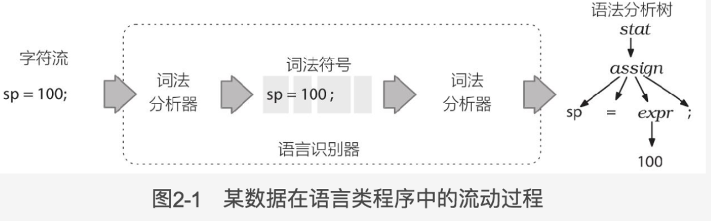

### ANTLR元语言开始
为实现一门编程语言,需要构建一个程序,读取输入的语句,对其中的词组和输入符号进行正确的处理.

语言(language)由一系列的有意义的语句组成,语句(sentence)由词组组成,
词组(phrase)由更小的子词组(subphrase)和词汇符号(vocabulary symbol)组成.

一个程序能够分析计算或者执行"语句",则将其称之为解释器

如果程序能将一门语言的语句转换成另一门语言的的语句,则将其称之为翻译器

为了达到预期目的,解释器或者翻译器需要识别出一门特定语言的所有的有意义语句,词组和子词组.识别一个词组意味着我们可以将它从众多的
组成部分中辨认和区分出来.

识别语言的程序称为语法分析器(parse)或者句法分析器(syntax analyzer).句法是指约束语言中的各个组成部分之间关系的规则,
本模块通过ANTLR语法来指定语言的句法.

语法(grammar)是一系列规则的集合,每条规则表述出一种词汇结构.

将语法分析的过程分解为两个相似但独立的任务或者阶段:

将字符聚集为单词或者符号(词法符号,token)的过程为词法分析(lexical analysis)或者词法符号化(tokenizing).
把可以将输入文本转换为词法符号的程序称为词法分析器(lexer).
词法分析器可以将相关的词法符号归类,例如INT(整数),ID(标识),FLOAT(浮点数).
当语法分析器不关心单个符号,而仅关心符号类型时,词法分析器就需要将词汇符号归类.
词法符号包含至少两部分信息:词法符号的类型(通过类型来识别词法结构)和该词法符号对应的文本.

第二个阶段是实际语法分析过程,输入的词法符号被"消费"以识别语句结构.
默认情况下,ANTLR生成的语法分析器会建造一种名为语法分析树(parse tree)或者句法树(syntax tree)的数据结构,
该数据结构记录了语法分析器识别出输入语句结构的过程,以及该流程的组成部分.

语法分析树的内部节点是词组名,这些名字用于识别它们的子节点,并将子节点归类.\

根节点是最抽象的一个名字.语法分析树的叶子节点永远是输入的词法符号.
句子,也即符号的线性组合,本质上是语法分析树在人脑中的串行化.

通过语法分析树这种方便的数据结构,
语法分析器就能将诸如"符号是如何构成词组的"这样的完整信息传达给程序的其余部分.

### 2.2 实现一个语法分析器

ANTLR工具产生一个递归下降的语法分析器(recursive-descent parser).
递归下降的语法分析器实际上是若干递归方法的集合,每个方法对应一条规则.
下降的过程就是从语法分析树的根节点开始,朝着叶节点(词法符号)进行解析的过程.
首先调用的规则,即语义符号的起始点,就会成为语法分析树的根节点.
这种解析过程的更广为人知的名字是"自上而下的解析",递归下降的语法分析器仅仅是自上而下的语法解析器的一种实现.

**语法分析的规则以小写字母开头**

**词法分析的规则以大写字母开头**

**使用|来分隔同一个语言规则的若干备选分支,使用圆括号把一些符合组合成子规则.**

